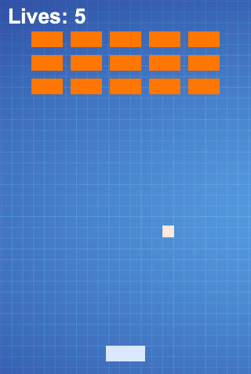

# Managing Assets {#assets}

In [the previous chapter](#initialization) we initialized Phaser and placed a canvas in our screen. In this chapter we're going to load the assets needed by Foxnoid.

Before we show the code to create the **preload** game state we should talk a bit about assets. These days many of the mainstream game makers appear to rely only on having shiny graphics on the screen. Many users are attracted to these type of games where having next generation gaphics trumps game mechanics. Building a game that relies only on its assets is a bad move in my humble opinion, also designing state of the art graphics requires a special type of team that many small developers don't have.

The focus of this book is building 2D casual games for smartphones. Usually the games that shine in the mobile market are the ones with the best mechanics (or the ones that are somewhat addictive) and tend not to rely too much on graphics since mobile phones vary so much in performance.

If you have a great idea, you can go on coding using placeholder graphics that are used only during development phase and later hire a proper designer to craft your real assets.

Just like tabletop game developers will craft prototypes out of cardboard and crayolas so can you build placeholder graphics and sounds using freely available tools. Any graphic software will work, it doesn't really matter if it is Adobe Photoshop or Microsoft Paint, as long as it can be used to build assets good enough for you to keep building your game we're all set.

## Defining Atmosphere

The main aspect of assets, and by assets I mean graphic and sound files used in your game, is that it help sets the atmosphere that your game will have. You can use bright primary colors in glossy shapes to build a candy inspired title for kids or you can use different grades of black, red and brown to create some minimalist horror genre. The mechanics in both titles could be the same and the game would differ only by its assets but *Candy Escape* would be a really different game than *Zombies: Run For Your Life*.

Game mechanics help reinforce the atmosphere of the game but its visual aspects are key to setting tone and conveying emotions to your player. Some mechanics make sense for some genres and are not good for others. Creating a game for one genre and using assets from a different genre will works if you call yourself indie and there is a chance that it will make you millionaire (a.k.a. Zombie: Brain Candy Escape will probably work).

An important step is to plan ahead. When defining your rules and planning your game you need to think what type of atmosphere you want and plan your assets accordingly.

A sometimes overlooked part of planning your assets is deciding on what form factors and platforms you will deliver your game.

## Planing For Different Form Factors

The focus of this book is Firefox OS but I don't advise you to deliver exclusively to this platform. The cool thing about the Web is how cross-platform it is. The same game you have running on Firefox OS can run with minimal tweaking on Android, iOS, Facebook, OUYA and others.

If you plan from the start to deliver to multiple platforms then you can prepare your assets as needed. When we talk about delivering web stuff to multiple platforms we're usually dealing with different screen sizes and proportions and different input methods. Well leave the input business to [the input chapter](#input) and talk about resolution and screen sizes here.

Have you ever pick thumbnail picture and enlarged it to fill a larger area? It looks pretty bad right? If you have a 16x16 png file and you resize it to 2500x1600 it will not look smooth. Its much easier to have a large resolution file and scale it down (which means discarding information) than it having a small file and scaling it up (which means creation of information or pulling rabbits out of hats).

If you're thinking about delivering your game to be playable on SmartTVs on full HD resolution then you need to have assets that look good in that resolution. You can scale them down to Firefox OS devices as needed and/or create simpler assets for such devices.

By planning ahead it becomes a lot easier to develop your game. If you start by developing a mobile game is a low resolution and then later decides to go to larger screens you may end up with a ugly game or the need to recreate your assets.

At least sound plays the same regardless of screen sizes...

A> Anedote: While I was developing Foxnoid, I decided to use some placeholder graphics until I could find a designer to build real graphics for me. In the end I liked my placeholder stuff so much that I decided to keep it. Anyway, I can keep it just because this is a toy game. I don't recommend that you stick with your placeholder graphics.

## Planning Our Game Assets

If we consider the minimum number of assets that we need for our game to playable they would be the background, the paddle, the brick and the ball. With only those four graphics we could assemble our screen and focus on game play.

Later we'll build more graphics to improve our game, right now we'll just build these four so that we can keep going.

### The background

We all know that I can't draw. So I decided to use a freely available graphic as a placeholder. [Mozilla Assets Repository](https://assets.mozilla.org/) is a collection of assets to help people developing Mozilla related stuff. Firefox OS has some really nice assets that are community oriented including a blue squared technical paper background. I cut a part of that background to use in this game.


### The block and the paddle

The block are the little bricks that are aligned in the top of the screen and we use for target practice with our paddle and ball. To create our brick I just selected a square in an appropriate size and used flood fill.


Be aware that the background image is a JPEG file because it is a file format that occupies less space but all the other assets are PNG files because this format has transparency support so that it blends better with the background asset.

If we think of the assets as a collection of images one on top of the other you will want to use a file format that allows you to layer stuff on top of each other with the transparent areas bleeding thru.


Our paddle is created in the same manner as the block and so is the ball. The ball is not a ball, its actually a square. I decided to use a square as our "ball" because it looks more in tune with our graphics and because it makes it a lot easier to detect collisions. Its far easier to detect collisions between rectangles than between other polygons or balls.

### How it looks when assembled

Our game looks like this



## Building The Preload Game State

So we have our assets ready and now, we'll proceed to build the game state that will be responsible for loading them into memory so that they are available to other states in our game.

### Preparing assets

To hold all our assets we created an **assets** folder in our **foxnoid** folder. We placed all our graphics files there and we're going to load them from our JS code below.


### Coding preload.js

As explained before, game states are just Javascript objects with special functions in them. These functions are called by Phaser during the game state lifecycle. Our preloader will load the graphic assets and then switch to the game state called **Game** after they are ready. 

The function that Phaser calls when it is interested in loading stuff is the ```preload()``` function of the game state.  In this function we'll load our assets. After calling ```preload()``` it will call ```create()``` which is where the game state can initialize things. Since after loading the assets there is nothing that our Preloader state needs to do we'll just use the ```create()``` call to switch to a different state. 

Create a file called **preload.js** inside the **js** folder. Add the code below to that file.

{lang="js", title="preload.js: the game state to load our assets", line-numbers=on}
~~~~~
GameStates.Preloader = {
    preload: function() {
        this.load.image('background', 'assets/background.jpg');
        this.load.image('player', 'assets/player.png');
        this.load.image('ball', 'assets/ball.png');
        this.load.image('block', 'assets/block.png');
    },
    create: function(){
        this.state.start('Game');
    }
};
~~~~~

The ```preload()``` function is where we load our graphics. We use ```this.load.image()``` calls to load each image passing to it two parameters:

* A key that will be used to refer to the image from now on.
* The path to the image file.

In the ```create()``` we just switch to the state named **Game** which we'll build in the next chapter.

### Changing index.html

Now that we have **preload.js** ready we need to change our **index.html** file to include it.

{lang="js", title="index.html: now includes our preloader", line-numbers=on}
~~~~~
<!DOCTYPE html>
<html>
    <head>
        <meta charset="UTF-8" />
        <title>Foxnoid Game</title>
        <link rel="stylesheet" href="css/style.css" />
        <script defer src="js/phaser.min.js"></script>
        <script src="js/init.js"></script>
        <script defer src="js/preload.js"></script>
    </head>
    <body>

        <div id="game"></div>

    </body>
</html>
~~~~~

### Changing init.js

Remember our initialization file? Well we need to change it too so that we register the **Preloader game state** with it.

{lang="js", title="init.js: is responsible for initializing Phaser", line-numbers=on}
~~~~~~~~
var GameStates = {}; // <-- Object to hold all our game states.

document.addEventListener("DOMContentLoaded", function()  {

    // Portrait game orientation. 

    var width = 320;
    var height = 480;

    var game = new Phaser.Game(width, height, Phaser.CANVAS, "game");
    
    // Add the Game States the game has.
    game.state.add('Preloader', GameStates.Preloader);
    
    // Now start the Preloader state.
    game.state.start('Preloader');

});
~~~~~~~~

The change is on line 13 where we use ```game.state.add()``` to add a game state to our game. The two parameters are:

* A key that we'll use to refer to the given state later.
* The object that holds our state.

Then on line 16 we launch the **Preloader** state. To learn more about the nuts and bolts of game states [refer to the Phaser.State documentation](http://docs.phaser.io/Phaser.State.html).

This moves us one step further to having a complete game.

## Summary

In this chapter we learn a bit more about assets and how they impact the atmosphere of our game and the experience the player has. We moved on to create out simple graphic assets and load them in a preload game state.

In the next chapter we're going to build our game loop and finally have a little ball bouncing on the screen.
