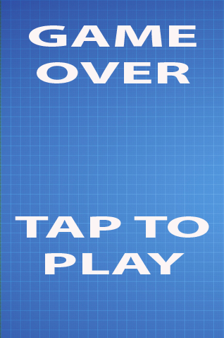
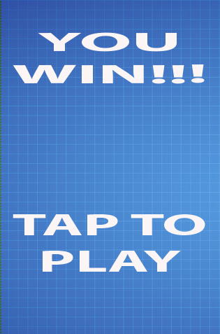

# Winning or Losing {#dressingup}

Foxnoid is now a playable game but you can't win it (or lose it). In this chapter we're going to solve that by adding both the game win and game over mechanics.

We're going to use two new game states one for each type of ending. Once each situation happens we're going to switch to the needed state. Game states are useful for many things but one special use that they excel at is when the nature of what is happening on your game changes. In the game over situation the player was playing the game but lost it and is no longer able to play, this fundamental difference from the previous situation is easily crafted with game state switches.

Winning and losing are important aspects of games. You can create games with just one of these items. A game with no winning scenario is a game where winning is basically seeing how long you can last before losing. Games without a losing scenario option are common these days, specially on mobile. Games where you can play forever until you win or even in some cases pay-to-win games where you can spend real money to advance a level or buy upgrades.

Flappy Bird is a game without a win scenario (or at least I don't know about it). Basically these type of games work really well if they are hard and use leaderboards where players can compete with each other to have the best score. 

Angry Birds is the kind of game where you can't really lose, you just keep stuck on a level until you pass it. That behavior is so common with mobile arcade/puzzle games that is basically the standard thing now.

In Foxnoid we're going to implement both a game win and a game over scenario.

## Game Over Scenario

Game over will happen once the player runs out of lives. His initial lives number is set by the ```initWorld()``` function and updated if needed by the ```ballCollidesWithGround()``` function. What we're going to do there is check if the player has zero lives and switch to a new game state called **GameOver** if needed. Lets alter that function:

{lang="js", title="game.js: the ballCollidesWithBlock() function with Game Over switch", line-numbers=on}
~~~~~
ballCollidesWithGround: function() {
    if (this.ball.y >= 470) {
        this.playerLives -= 1;
        this.resetBall();
    }

    /*
     Update player life display
     */

    this.livesDisplay.setText("Lives: " + this.playerLives);

    if (this.playerLives === 0) {
        this.state.start("GameOver");
    }

}
~~~~~

The important part is ```this.state.start("GameOver")``` which switches to the new state. Our new state will look like this during the game:



We're using the same background as the one in the game with two images for the text parts. We need to add these images to the **Preload** state, so edit the **preload.js** like this:

{lang="js", title="preload.js: the game state to load our assets", line-numbers=on}
~~~~~
GameStates.Preloader = {
    preload: function() {
        this.load.image('background', 'assets/background.jpg');
        this.load.image('player', 'assets/player.png');
        this.load.image('ball', 'assets/ball.png');
        this.load.image('block', 'assets/block.png');
        this.load.image('gameover', 'assets/gameover.png');
        this.load.image('taptoplay', 'assets/taptoplay.png');
    },
    create: function(){
        this.state.start('Game');
    }
};
~~~~~

As you can see we simply added two images to the ```preload()``` function, this way they are available to our new game state once it loads. Talking about game states we need some steps when creating a new one. First thing we need to create a new file. Lets call it **game_over.js** and place it inside the **js folder**.

We need to include it in **index.html** as shown here

{lang="js", title="index.html: now includes our game over state", line-numbers=on}
~~~~~
<!DOCTYPE html>
<html>
    <head>
        <meta charset="UTF-8" />
        <title>Foxnoid Game</title>
        <link rel="stylesheet" href="css/style.css" />
        <script defer src="js/phaser.min.js"></script>
        <script src="js/init.js"></script>
        <script defer src="js/preload.js"></script>
        <script defer src="js/game.js"></script>
        <script defer src="js/game_over.js"></script>
    </head>
    <body>

        <div id="game"></div>

    </body>
</html>
~~~~~

After including that file in the HTML we need to register the state in **init.js** as seen here:

{lang="js", title="init.js: with the new game over state", line-numbers=on}
~~~~~~~~
var GameStates = {}; // <-- Object to hold all our game states.

document.addEventListener("DOMContentLoaded", function()  {

    // Portrait game orientation. 

    var width = 320;
    var height = 480;

    var game = new Phaser.Game(width, height, Phaser.CANVAS, "game");
    
    // Add the Game States the game has.
    game.state.add('Preloader', GameStates.Preloader);
    game.state.add('Game', GameStates.Game);
    game.state.add('GameOver', GameStates.GameOver);
    
    // Now start the Preloader state.
    game.state.start('Preloader');

});
~~~~~~~~

With those steps done we can code **game_over.js**

{lang="js", title="game_over.js: player lost, how sad", line-numbers=on}
~~~~~~~~
GameStates.GameOver = {
    create: function() {

        // Add the background
        this.add.sprite(0, 0, 'background');

        // Add the message
        this.add.sprite(20, 30, 'gameover');

        // Add the tap to play button
        this.add.sprite(20, 300, 'taptoplay');
    },

    update: function() {

        /**
         * We just want to detect a tap. 
         * If there is one, we switch back to the game
         * state and start the game again
         */

        if (this.input.pointer1.isDown) {
            this.state.start('Game');
        }

    }

};
~~~~~~~~

This new game state is pretty simple. On ```create()``` we build the screen with our messages and on ```update()``` we keep checking for a touch on the screen. If the player touches the screen we switch to the **game** state which restarts the game.

## Game Win Scenario

The game win scenario will be the same as the game over scenario but with different images. As seen here



First lets add the new image to the **preload** state:

{lang="js", title="preload.js: the game state to load our assets", line-numbers=on}
~~~~~
GameStates.Preloader = {
    preload: function() {
        this.load.image('background', 'assets/background.jpg');
        this.load.image('player', 'assets/player.png');
        this.load.image('ball', 'assets/ball.png');
        this.load.image('block', 'assets/block.png');
        this.load.image('gameover', 'assets/gameover.png');
        this.load.image('taptoplay', 'assets/taptoplay.png');
        this.load.image('gamewin', 'assets/gamewin.png');
    },
    create: function(){
        this.state.start('Game');
    }
};
~~~~~

And create a file **game_win.js** in the **js folder**. We need to register this new game state in **init.js** and add it to the **index.html**.

{lang="html", title="index.html: now includes our game win state", line-numbers=on}
~~~~~
<!DOCTYPE html>
<html>
    <head>
        <meta charset="UTF-8" />
        <title>Foxnoid Game</title>
        <link rel="stylesheet" href="css/style.css" />
        <script defer src="js/phaser.min.js"></script>
        <script src="js/init.js"></script>
        <script defer src="js/preload.js"></script>
        <script defer src="js/game.js"></script>
        <script defer src="js/game_over.js"></script>
        <script defer src="js/game_win.js"></script>
    </head>
    <body>

        <div id="game"></div>

    </body>
</html>
~~~~~

After including that file in the HTML we need to register the state in **init.js** as seen here:

{lang="js", title="init.js: with the new game win state", line-numbers=on}
~~~~~~~~
var GameStates = {}; // <-- Object to hold all our game states.

document.addEventListener("DOMContentLoaded", function()  {

    // Portrait game orientation. 

    var width = 320;
    var height = 480;

    var game = new Phaser.Game(width, height, Phaser.CANVAS, "game");
    
    // Add the Game States the game has.
    game.state.add('Preloader', GameStates.Preloader);
    game.state.add('Game', GameStates.Game);
    game.state.add('GameOver', GameStates.GameOver);
    game.state.add('GameWin', GameStates.GameWin);
    
    // Now start the Preloader state.
    game.state.start('Preloader');

});
~~~~~~~~

With that done we can code the **game_win.js** file.

{lang="js", title="game_win.js: player won!", line-numbers=on}
~~~~~~~~
GameStates.GameWin = {
    create: function() {

        // Add the background
        this.add.sprite(0, 0, 'background');

        // Add the message
        this.add.sprite(20, 30, 'gamewin');

        // Add the tap to play button
        this.add.sprite(20, 300, 'taptoplay');
    },

    update: function() {

        /**
         * We just want to detect a tap. 
         * If there is one, we switch back to the game
         * state and start the game again
         */

        if (this.input.pointer1.isDown) {
            this.state.start('Game');
        }

    }

};
~~~~~~~~

We've created all files necessary for the game to be winnable but we still need to add that condition to our **game.js** state. The player will win once all the blocks are removed from the game. The best place to check that is during ```update()``` after the collision check that destroys the blocks. Lets add a function to that file:

{lang="js", title="game.js: new function to check for game win condition", line-numbers=on}
~~~~~~~~
checkGameWin: function () {
    if (this.blocks.countLiving() === 0) {
        this.state.start("GameWin");
    }
}
~~~~~~~~

The ```this.blocks.countLiving()``` call is from ```Phaser.Group``` and returns the number of sprites alive in a given group. Since each time there is a collision with a block we ```kill()``` it then that function will return zero once all blocks are cleared. When that happens we switch to the game win scenario that works just like the game over one. 

We need to add it to the ```update()``` function:

{lang="js", title="game.js: the new update() function", line-numbers=on}
~~~~~
update: function() {
   this.handleTouchInput();
   this.handleKeyboardInput();
   this.checkHitWithBlocks();
   this.checkHitWithPlayer();
   this.ballCollidesWithGround();
   this.checkGameWin();
}
~~~~~

Now you can play and win or lose the game!

## Summary

In this chapter we added mechanics for winning and losing the game. In the next chapter we're going to keep players engaged by adding levels to the game.