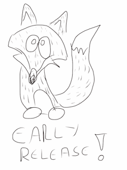

{frontmatter}

## Warning

**This is a work in progress. You're handling an early release of an unfinished book.**

Pick a bucket of LEGO pieces and throw them randomly on the floor. Now, blindfold yourself, spin 20 times and start walking around. This is the kind of danger you're facing here. Content will change and feedback is more than welcome.

This release is so early that its 5:15 AM in here and I am still writing...

**You've been warned!**

## Acknowledgments

To my wife Lili, the best wife in the world!

To Mozilla for always believing in us, for keeping the web open and free and for always placing the user first!

To the Brazilian Mozilla Community for receiving me so well and being just awesome!

To my GSoC mentor Soledad Penades, the Mozilla Apps Team, the Mozilla Tech Evangelists and Dev Engagement teams for being more than awesome!

To Google for the Google Summer of Code 2014! This program is FANTASTIC.

## This book is in perpetual beta

My plan is to update this book often, expanding its contents and revising the text as issues are found by readers. Since some APIs are still being implemented by Firefox OS, you will want to make sure you're reading an up-to-date version of this book. Also as time goes by after the initial release of this book I will be able to explore more aspects of game making and thus make this a more complete resource

## Me, myself, and I

In this book you will find many parts where I express my personal opinion and make decisions that may be different from what other programmers would do - particularly if it helps explain an idea more easily. I will always try to make it clear and explain my reasoning when I am giving my opinion. Anyway, if there is an error in what I am saying, I will revise the text and update the book. See the Feedback & Pull Requests section for more information.

## Want to know more about Firefox OS Dev?

This book is targeted at Game Development but there are other books and resources for those wanting to know more about Firefox OS Development such as:

* [The Quick Guide for Firefox OS Development](https://leanpub.com/quickguidefirefoxosdevelopment/): a free and open source sibling to this book but focused on app development. If you're reading this book you probably will like that one too.
* [Firefox OS Developer Hub](https://marketplace.firefox.com/developers): The developer hub on Firefox Marketplace contains a lot of information and resources about creating Firefox OS applications.
* [The Firefox OS Zone on Mozilla Developers Network](https://developer.mozilla.org/en-US/Firefox_OS): MDN is probably one of the most important developer resource online focused on web technologies. Its a free and open source treasure trove of documentation, samples and articles. This link is for the Firefox OS zone that aggregates links related to this new platform.
* [Beginning Firefox OS HTML5 Game Programming](http://www.amazon.com/dp/B00IZUYIGO): Bob Thulfram has released this awesome book on Amazon. If you want more resources about Game Development on Firefox OS you need to check this one out.
* [Firefox OS Gaming Blog](http://firefoxosgaming.blogspot.co.uk/): Bob Thulframs blog about Firefox OS Gaming. After you start creating games you will probably see your creations featured here :-)

There is now a site that lists all known books related to Firefox OS at [http://firefoxosbooks.org](http://firefoxosbooks.org).

## How this book came to be

This book is a sibling to the [Quick Guide for Firefox OS Development](https://leanpub.com/quickguidefirefoxosdevelopment/) which is a similar book that cover making apps for Firefox OS. After releasing that book and talking to many people, I though we needed a similar resource targeting game development since that is often one of the overlooked aspects of developer documentation. This book shares some content with the quick guide.

I kept that idea on the back burner for when I had time to implement it but the new GSoC 2014 was upon us and I decided to submit this as a project. Being a GSoC student is wonderful and enables me to dedicate time to this type of effort without the peril of not paying my monthly bills. Its a fantastic program that empowers us students to deliver quality open source material that otherwise would take too long to create.

## Staying up to date

This book is distributed for **free** using [Leanpub](http://leanpub.com).

You can register your email to receive automatic updates when you download this book from its [book page at Leanpub](http://leanpub.com/buildinggamesforfirefoxos). The plan is to update this book monthly. If you got this book from a friend or from some other site, you should consider going to the page above to download and register there thus making sure you will receive the update notices.

## Donations

Writing a book requires a lot of work and I would like to dedicate more time in my life for this type of activity after the 2014 Google Summer of Code is done. Those that think that this book is useful (or cool) may move the price slider on Leanpub download page from zero to any desired amount and give me some bucks.

Those that would rather donate using PayPal, I can receive donations under the *agarzia@mac.com* account.

I can accept bitcoin donations at:

[17TNW3pw9iJUD24k2CB4wv6rJaQkZUsGFU](bitcoin:17TNW3pw9iJUD24k2CB4wv6rJaQkZUsGFU)

And dogecoin donations (such generosity, much development) at:

[DQ4puwF5uFcdt7WZNMoo7V3Y373VD6aHFx](dogecoin:DQ4puwF5uFcdt7WZNMoo7V3Y373VD6aHFx)

Regardless of donations, you should fill your email on the download form to make sure that once the book is updated you will receive a notice!

## How to contact the author

To send comments and feedback please send an email to [fxosgamedevguide@andregarzia.com](mailto:fxosgamedevguide@andregarzia.com). My website is [http://andregarzia.com](http://andregarzia.com). My Twitter account is [@soapdog](http://twitter.com/soapdog).

If you want to help improve the content of this book, please see the Feedback & Pull Requests section.

## Cover Illustration

The cover page was created by Raphael Eckhardt, a designer and illustrator from Brazil. You can check out his work and contact him (he is a freelancer) at [http://raphaeleckhardt.com/](http://raphaeleckhardt.com/).

## Who should read this book

This book is written for readers with an intermediate knowledge of HTML, CSS and JavaScript who wants to begin their path on the wonderful world of Game Development. Teaching HTML, CSS and JavaScript is beyond the scope of this book. I will give you links for good reference books though.

## Feedback & Pull Requests

This is a Free and Open book and I am excited to receive all feedback that you people can give me. All the content of the book is at a [GitHub repository](https://github.com/firefoxos-gamedev/book) and is built using Markdown (with some extensions by Leanpub). To give me feedback, bug fixes and improvements just send me a pull request. Thanks in advance for all contributions.

The Git repository for this book is at [https://github.com/firefoxos-gamedev/book](https://github.com/firefoxos-gamedev/book).

## Version history

### Version 0.1

**This is not a released book!!!** This version is a work in progress version. We're releasing early and releasing often.

{mainmatter}
