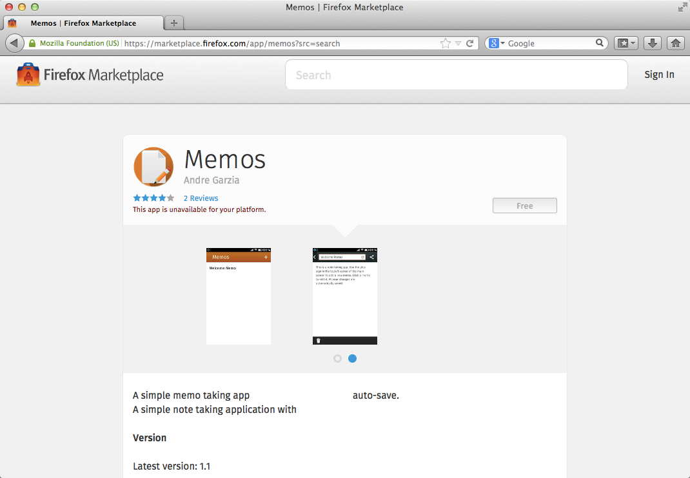

# Setting Up Our Game {#gamescaffold}


Firefox OS games are built like all Firefox OS apps. To dive deeper into Firefox OS app development you can download the Free and Open Source book [Quick Guide For Firefox OS Development](https://leanpub.com/quickguidefirefoxosdevelopment/) or you can just read it online, specially the chapter about [basic concepts](https://leanpub.com/quickguidefirefoxosdevelopment/read#concepts).

Firefox OS applications are a collection of HTML, CSS and Javascript files. While most business applications deal with all these three technologies, mobile web based game development tend to use much more Javascript than HTML and CSS. Using the [powerful Canvas API](https://developer.mozilla.org/en-US/docs/Web/HTML/Canvas) to display 2D graphics, [Web Audio API](https://developer.mozilla.org/en-US/docs/Web/API/Web_Audio_API) for audio and [Touch Events API](https://developer.mozilla.org/en-US/docs/Web/Guide/Events/Touch_events) for input we're pretty much set.

## Application Types

Firefox OS currently has two types of applications: hosted apps and packaged apps:

* **Hosted Apps:** Are hosted on a web server just like normal websites. This means that when the user launches a hosted app, its content is loaded from the remote server (or from the cache, if available).
* **Packaged Apps:** Are distributed as a zip file and copied to the device when installed. When the user launches a packaged app, its contents are loaded from the zip file instead of a remote server.

There are Pros and Cons to using each type. Games tend to use a lot of static resources such as image and sound files. If you use a hosted app then your user will need to download and cache all these files before playing. If instead you opt for a packaged app then all the static resources are bundled and copied to the device when the application is installed so there won't be a need to download anything after the initial installation.

In this book we'll use a packaged app approach. Its easier to develop since we don't have to deal with cache and cache invalidation and the use doesn't have to wait for things to load after the installation.

## The Application Manifest

The [manifest](https://developer.mozilla.org/docs/Apps/Manifest) is a [JSON](http://json.org) file that describes aspects of an hosted web app. Usually this file is called **manifest.webapp** and lives next to your main HTML file that is usually called **index.html**.

<<[Sample Manifest](code/sample_manifest.webapp)

Above we can see the manifest for an application called memos[^memos]. Among other things it describes who created the application, which icons are used, what is the name of the app, what file is used to launch the app (in this case it is *index.html*), what hardware access permissions your app requires, etc. This file is used by Firefox OS to add the application to the device's home screen and by the Firefox Marketplace to display the application on the catalog as we can see in the image below.

[^memos]: This is a sample app for Firefox OS as [seen on the Firefox Marketplace](https://marketplace.firefox.com/app/memos) for which the [source code is on GitHub](https://github.com/soapdog/memos-for-firefoxos).



Note how the information from the manifest is used by the system to add the app to the homescreen, as we can see on the following screenshot.


By gathering your HTML, CSS, JavaScript, and a manifest file you already have an application ready to run on Firefox OS. With this in our mind lets begin building our application.

## There Is No Place Like Home

Lets give Foxnoid a nice home in your computer. As we know, we're going to build a collection of HTML, CSS, Javascript and static resource files. All these files will be organized inside a folder on your machine. **Your first task is to create a "foxnoid" folder in your machine, all we do will happen inside this folder**.

Below we'll add some boilerplate just to start our app to the point where we can focus on the Javascript part of things. Most frameworks include some boring code that you need to have to initialize everything.

Through the remaining of this chapter we're going to write this code. It will be responsible for starting our game. The game implementation itself is written in the following chapters.

## Adding The Phaser Framework

Fetch the latest Phaser from [phaser.min.js on GitHub](https://github.com/photonstorm/phaser/releases/download/v2.0.5/phaser.min.js) and place it in a **js folder inside foxnoid folder**.

This file contains the whole Phaser framework in minifed form. By including this Javascript file in the HTML we'll be able to use its features from our game.

## The CSS

Since we'll use Canvas to draw our game display we're not going to rely on CSS to style things. Still we need to reset some values because different browsers assume certain values for margins and paddings. We want to zero these values so that we can fill the screen with the Canvas.

Create a css folder inside foxnoid folder and place a file called style.css inside it with the following content:

<<[CSS Reset](code/foxnoid/css/style.css)

This will set the default background color and reset the needed values.

## The HTML

As explained above we're not going a lot of CSS and DOM. This game is just Canvas stuff so all our HTML needs is to include all the needed Javascript files and have a single ```div``` to hold our canvas.

Some games are better written with DOM others we'll do pretty fine with Canvas. You can think of a canvas as a Television where image will be displayed. Programming with canvas is closer to building games for old DOS and Gameboys then structuring hypertext with HTML.

We're going to change this HTML as the chapters go on but for now, create a file called **index.html** with the following content:

<<[Minimal index.html](code/foxnoid/index.html)

This HTML does nothing besides giving us a place to hold our canvas and including Phaser.

A>*Tip:* Using ```defer``` on the script tags will give us better performance since the JS files will only be executed after the DOM is ready.
 
## Some Javascript

## Planning For Development