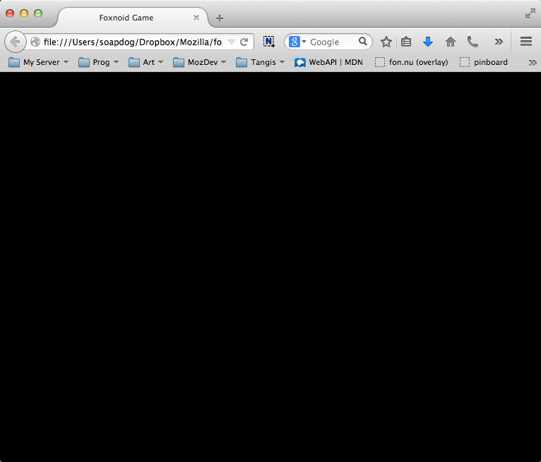

# Initializing Foxnoid {#initialization}

In this chapter we're going to learn how to start our game. This may sound simple and silly but this book takes baby steps and tries to explain why we're doing things instead of just dumping a bunch of code that you'll use without understanding. I believe that programming is the act of organizing complexity. You can only organize something if you actually understand whats going on, without understanding organizing stuff becomes a game of blindfolded sokoban[^sokoban].

[^sokoban]: A transport puzzle game. Learn more about it at [its wikipedia page](en.wikipedia.org/wiki/Sokoban).

Before talking about game initialization we need to backpedal a bit and understand about game lifecycles and game states.

## A Bit About Game Lifecycle

You can think about the game lifecycle from a birds eye view. In that case a game is something you launch, play and eventually close. So from this broad picture you can think of three stages in the game playing process. The game is launching, playing or closing. Each of these states can be further organized into smaller states.

If we were an eagle soaring high and could use the cheating eyes that nature gave us then we could **zoom** into these game states and see what they are composed of. Since we're not eagles then I am going to use an analogy to explain this thing. Lets thing of a game as if it was a dinner out of home.

## Game States

### Game States as a restaurant analogy

First step is entering the restaurant, being seated and ordering food. This is similar to launching because when this process ends, we're in the state where food has been ordered. In terms of games we can think of this state as your application launching and loading its libraries.

Second step happens in the kitchen. The cook needs to have the ingredients ready so that your order can be prepared. Ingredients are assets that need to be there or the food can't be prepared correctly. Imagine a cook running to and from a super market while your order is prepared, I assure you it will be the last time you have dinner in that place.

In a game assets are all the resources such as images, sounds and auxiliary files that need to be loaded before the game is playable. We've all seen web pages loading stuff while displaying stuff. You get a lot of relayout, reflows and repaints operation. We learned not to care much about it but imagine if this happened in a game of Super Mario, you're there trying to play while the level and enemies are still loading. That leads to a poor experience.

Third step is preparing your food. With the assets available, the cook can work the magic and deliver a nice plate. This is where your game uses all the needed resources to initialize the game itself. Following our Super Mario example, this is loading the maps and building the level.

Fourth step is having dinner! This is the fun step, so this is also our game playing step.

Fifth step, dinner is over and you're going home. This is when the user decides its time to go and closes your game.

### Cute analogy but can we focus on game dev for a bit

The steps above are the broad steps needed by all games but depending on your needs your states will vary. A huge game such as any recent Zelda series title can't load all its assets at once because there is no such thing as infinite computer memory. When you have a game that is huge and has lots of assets its common to break the game playing state into a loading and playing state where you just load what it is needed to play that part of the game.

Game states are just a way for you to slice and dice your game into manageable bits so that you can focus on one task at a time. You can think of them as an assembly line preparing your game to be ready as the app switches between states. The most important aspect is that the more self contained each state is the easiest it is to maintain your code in the long run. You use game states for the same reason that your wardrobe has drawers, if it was just an empty box that you threw stuff in, then it would be really tricky to get dressed in time for the dinner out.

If you're building a game such as Super Mario you could have a different state for each different screen, so that the title, the options, the map, the level, the win and the game over screens could each be their own state and handle the loading of assets and work on their own. This way its easier to switch bits of the game.

### Game states in Phaser

Phaser has game state features as we can see in the [documentation for the State Class](http://docs.phaser.io/Phaser.State.html). Each state can be self contained and handle its own asset loading, working and switching to a different state. Basically each state can be its own tiny assembly line.

A Phaser state is a Javascript object that has methods you can override to handle each of the steps mentioned in our restaurant analogy. For example if you want to load assets you will do it in the ```preload()``` function of that state. If you want to assemble the game level and build the screen you're displaying you will do it in the ```create()``` function. The food eating/game playing happens in the ```update()``` function and so on.

We're going to talk much more about game states as we build Foxnoid. Since we're talking about Foxnoid now...

### Foxnoid game states

Foxnoid is a game in the tradition of Arkanoid. Its a classic arcade game like Pacman, Pong, Tetris and others. Lets plan the states used in our game.

{title="Foxnoid Game States"}
| Name          | Responsible for   |
|---------------|-------------------|
| Preload       | Will load all the assets needed for the game. |
| Game          | The actual game.  |
| GameWin       | When the user wins the game |
| GameOver      | When the user loses it |

As you can see we're going to have four states in Foxnoid. The first one will load our assets and then switch to the game. The user will play the game and depending on the outcome we'll switch to Game Win or Game Over state.

The remaining of this chapter we'll be about what should happen before we're able to switch to the **preload** state. There is some initialization that needs to be done prior to start loading assets.

## What Should Our Initialization Handle?

Out initialization code should handle everything that is needed before we can start switching between the states. It should load all libraries needed for our game to work (in our case just Phaser) and initialize them. The rest is up to each state.

## Initializing Phaser

Lets create a file called **init.js** inside the **js** folder.

{lang="js", title="init.js: is responsible for initializing Phaser", line-numbers=on}
~~~~~~~~
var GameStates = {}; // <-- Object to hold all our game states.

document.addEventListener("DOMContentLoaded", function()  {

    // Create your Phaser game and inject it into the game div.
    // For more information regarding the Phaser Game object refer to:
    // http://docs.phaser.io/Phaser.Game.html

    // Portrait game orientation. 

    var width = 320;
    var height = 480;

    var game = new Phaser.Game(width, height, Phaser.CANVAS, "game");

});
~~~~~~~~

On line 01 we create an empty object. This will be used to hold all our game states, this way instead of having four different globals around we're going to have only one.

A>**Disclaimer:** Yes, I could use an immediate function and have no globals at all but this is a beginner oriented book and I don't want lose precious pages explaining about closures and nameless functions that invoke themselves. 
A>
A>That being said, those that understand those features can clearly see how easy it would be to use them here. Just surround that init file and be happy. For those that have no clue what I am talking about but would like to know more then check out [Appendix 2: Javascript Books](#jsbooks) for some reference material.

From line 03 to 17 we have the ```DOMContentLoaded``` event handler function. This will be executed once all the DOM is loaded. Its inside this handler that our game initialization happens. At this moment, initializing our game is basically loading Phaser and instantiating the the ```game``` variable. This game variable is the main object that is used to access the features from Phaser. You can learn more about it at [the documentation for the Phaser Game Class](http://docs.phaser.io/Phaser.Game.html).

We call ```Phaser.Game()``` on line 14 passing four parameters to it. The first two are the dimensions for the canvas used in our game. We can think of it as the size of our desired screen. Phaser can work with both Canvas and WebGL renderers but the later is not well supported on mobile devices so for casual 2D games, I recommend sticking with Canvas. The fourth parameter is the id of the DOM element that will hold the canvas. Once that line is executed Phaser will initialize a canvas object inside the element specified. 

Even though we created the **init.js** file, we haven't included it on our **index.html** file yet. Lets do it.

{lang="html", title="index.html: including our init.js file", line-numbers=on}
~~~~~
<!DOCTYPE html>
<html>
    <head>
        <meta charset="UTF-8" />
        <title>Foxnoid Game</title>
        <link rel="stylesheet" href="css/style.css" />
        <script defer src="js/phaser.min.js"></script>
        <script src="js/init.js"></script>
    </head>
    <body>

        <div id="game"></div>

    </body>
</html>
~~~~~

If we open our **index.html** on our browser now, we'll see a black screen. Thats the canvas working but since it has nothing to do it stays black.



The above screenshot is all black because our canvas is black and our background color in the HTML is also black. Now after that initialization we can begin working on our game states.

## Summary

In this chapter we explained about game states and how we can use them to organize our game into manageable bits by placing logical stuff together. We decided on building four states for the Foxnoid game and we've reached a point where we have a black screen.

On the next chapter we're going to build our **preload** game state and load our resources.
