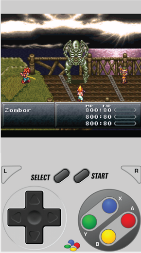
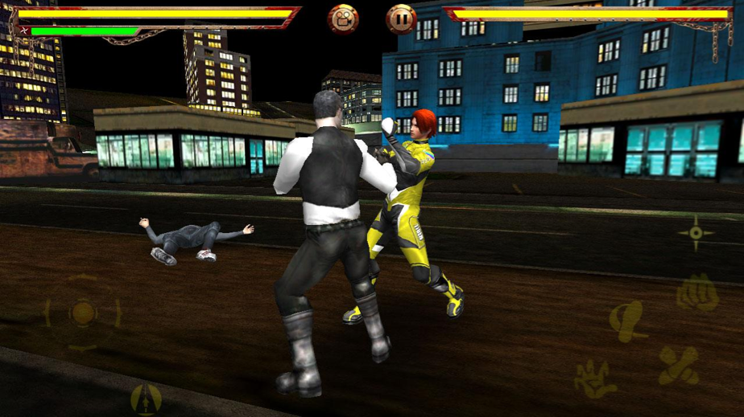
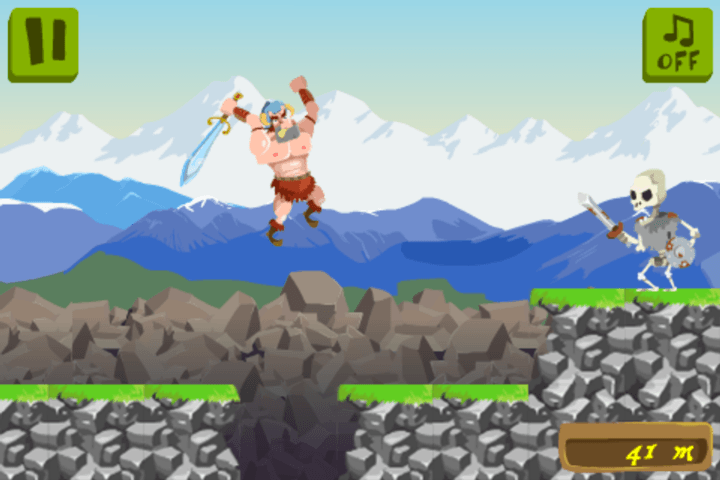
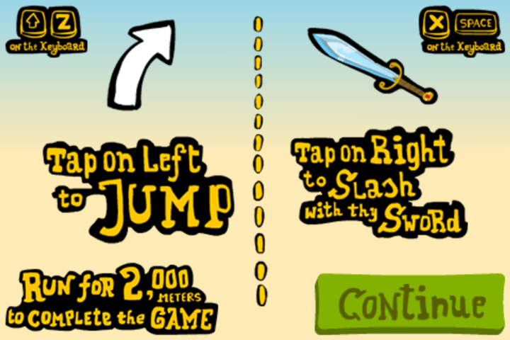

# Handling Input {#input}

In this chapter we're going to make our game playable by adding routines to control the player paddle. Before showing the code to do it we should stop and think a bit about video game controls.

## The Action That Drives The Game

Player controls can make or break a game. You should pay special consideration to how you're implementing this in your game and should experiment with different schemes before settling on a solution. The best thing is to prototype your proposals and test them with people.

One common practice is to devote an area of the screen to a virtual gamepad like interface. That type of solution uses a good part of the screen and unlike its real world counterparts (a.k.a. console controllers) virtual gamepads provide really bad tactile feedback.



Another common option is a gamepad like overlay that is placed on top of the game screen with usually almost transparent interface as can be seen below:



In both cases you have specific areas of the screen that need to be hit to control the player actions. In some cases these controls are good. In the examples above one is an popular video game emulator and has no other option besides simulating the real video game controller and the other is a [fighting game](https://play.google.com/store/apps/details?id=com.jiinfeng3d.bfrdemo), a genre that involves a lot of quicktime actions and button mashing.

But imagine just for a bit if the popular hit **Angry Birds** used a control scheme such as the ones above. Would you still play it? Would the mechanic of sling shooting poor avians be as rewarding using a virtual gamepad as it is with dragging and releasing that rubber band? It is my firm belief that the more transparent/organic mobile controls are the best it is. Mobile devices have a huge touch screen that can all be used for input. Instead of bolting traditional control schemes into a mobile device we can think of clever usages of the touch screen.

Below we can see a screen shot of the game [Craigen](https://marketplace.firefox.com/app/craigen) which is a kind of infinite runner where you need to jump obstacles and hit monsters.



This is the type of game that would generally be coded using virtual gamepads or overlays but the author had a better idea as we can see here:



He simply divided the screen in two halves and touching one side means jump and the other means hit. You don't need to touch a specific point, just anywhere on one half or the other. This leads to a very enjoyable experience and happier users.

## Touch Input Considerations

When designing games for mobile devices with touch screens you should take really good care to think an unobtrusive way to control your game. Pick top mobile games to see how they are solving this task and plan your game accordingly. Some important things you should consider:

The player hand/finger will move over the screen occasionally hiding part of it from view. Try to keep your interactions closer to the border of the screen. If something happens in the middle regions make it so that the player can touch and remove the finger from the region quickly to avoid blind spots.

Beware of designing small items for the player to touch. The finger tip is not very precise. If you're placing items for the player to tap on the screen try not to place them too close to one another. Just remember how many times you typed the wrong letter in the virtual keyboard of your phone. For example, if you're building a game like [Minesweeper](http://en.wikipedia.org/wiki/Minesweeper_%28video_game%29) try to use a large grid to avoid wrong selections.

## Keyboard Input

Keyboard input is quite straightforward. One thing we should mention is that even when coding a mobile game you should consider having standard keyboard input as well. One advantage is that is helps while development and will allow you to deploy on both mobile devices and desktop-class devices.

## Gamepad Input

Gamepads are becoming more popular with casual gamers on desktop computers and mobile devices. There are many mobile device compatible controllers out there and offering support for such controllers on your app is a way to get more players. There is an [HTML5 Gamepad API](https://developer.mozilla.org/en-US/docs/Web/Guide/API/Gamepad) that you can use in your own games.

The main thing about gamepad controllers is that sometimes they are really different from one another regarding button placement. If you're supporting gamepads, you should offer a screen for the player to alter controller configuration such as what button is pressed to fire or jump. As an anecdote let me tell you that I have a cheap Chinese gamepad that was soldered wrong (I believe it was a mistake) and has the directional axis inverted. I can't use that controller at all with games that do not allow me to customize the controls due to it being kinda upside down internally.

## Controlling Our Game

For the sake of brevity we're only going to implement touch and keyboard input. Phaser has support for gamepads out of the box but this is out of the scope of the simple game we're building because I don't want to implement the option screen at the moment. If you want to know more about gamepad APIs in Phaser refer to the [Gamepad documentation](http://docs.phaser.io/Phaser.Gamepad.html).

What are the needs of Foxnoid regarding player control? Basically the player controls a paddle which moves left or right and thats it. Like that Craigen game we're going to divide the screen in two halves and touching any half will cause the paddle to start moving in that direction. We're going to add support for keyboard input with the arrow keys.

### Handling Touch

As explained in the [Gameloop chapter](#gameloop) we should acquire player input at every loop. This means that we're going to create one extra function in our *game.js* and call it from ```update()```.

{lang="js", title="game.js: the handleTouchInput() function", line-numbers=on}
~~~~~
handleTouchInput: function () {
    if (this.input.pointer1.isDown) {
        if (this.input.pointer1.worldX > 160) {
            this.player.body.velocity.x = this.playerSpeed;
        }

        if (this.input.pointer1.worldX <= 160) {
            this.player.body.velocity.x = -1 * this.playerSpeed;
        }
    }
} 
~~~~~

To handle touch input we're using the Phaser Input routines. To learn more about them refer to [Phaser.Input documentation](http://docs.phaser.io/Phaser.Input.html).

Basically by default Phaser initialize with support for two fingers input, first finger will be bond to ```this.input.pointer1``` and if a second finger touch the screen at the same time it will be bond to ```this.input.pointer2```. If we wanted extra touch inputs we could create them. In our case we just need a single input touching one side of the screen or the other. Thats why we're just checking ```this.input.pointer1```.

The properties ```this.input.pointer1.worldX``` give us the coordinate in the X axis where the touch happened. Since our game world is 320 pixels wide it is very easy to figure out in which side the player touched. Depending on the side we apply a **velocity to the player paddle in that same direction**. The value of that velocity is in the ```this.playerSpeed``` constant that is set in the ```this.initWorld()``` function.

The Arcade Physics system used by Phaser will calculate the paddle position based on that velocity on its own, thats the beauty of using proven frameworks, no more fiddling with physics formulas.

### Handling Keyboard

The keyboard code is very similar to the one above in the sense that we just check which arrow key the player is pressing and then apply a velocity to the paddle.

Phaser has a handy method for us to call that setups an default keyboard handler using the arrow keys. We can use that instead of registering each key we want to listen. This could all be done with normal HTML event listeners but since we're using Phaser here we can use its own functions because they tie up with the rest of the ```update()``` loop nicely.

{lang="js", title="game.js: the handleKeyboardInput() function", line-numbers=on}
~~~~~
 handleKeyboardInput: function () {
    if (this.cursors.right.isDown) {
        this.player.body.velocity.x = this.playerSpeed;
    }

    if (this.cursors.left.isDown) {
        this.player.body.velocity.x = -1 * this.playerSpeed;
    }
}
~~~~~

To use this code we must add a little bit to the ```initWorld()``` function. We need to tell Phaser to setup the default arrow keys keyboard manager for us.

{lang="js", title="game.js: the new initWorld() function", line-numbers=on}
~~~~~
initWorld: function() {
    // Some constants
    this.playerSpeed = 250;
    this.ballSpeed = 220;
    this.blocksPerRow = 5;
    this.blockRows = 4;
    this.playerLives = 13;

    // Add the background
    this.add.sprite(0, 0, 'background');

    // Add keyboard input.
    this.cursors = this.input.keyboard.createCursorKeys();
}
~~~~~

With that call at the end of ```initWorld()``` we'll be able to check ```this.cursors``` in the ```update()``` function. To learn more about keyboard input check out [Phaser.Keyboard documentation](http://docs.phaser.io/Phaser.Keyboard.html). Without that change to ```initWorld()``` the ```this.cursors``` would be undefined.

### The update() function

This is how the ```update()``` function looks with the new input routines.

{lang="js", title="game.js: the new update() function", line-numbers=on}
~~~~~
update: function() {
   this.handleTouchInput();
   this.handleKeyboardInput();
   this.checkHitWithBlocks();
   this.checkHitWithPlayer();
   this.ballCollidesWithGround();
}
~~~~~

Now our game is playable!

## Summary

In this chapter you've learned about input handling and why you should consider your player control scheme carefully before building your game. We've added both keyboard and touch input to Foxnoid. The game is now playable but still we don't have a win and lose scenarios.

The full source for the **game.js** file is at [Appendix 6: Input Chapter Code](#appendix-input)

In the next chapter we're going to add a game win and a game over condition to Foxnoid.