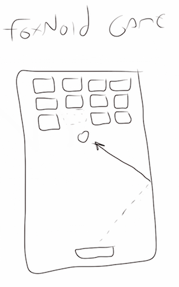

# Our Game {#ourgame}

It all starts with a badly designed sketch...

## Introducing Foxnoid

Our game will be the classic game where the player controls a paddle and use it to bounce balls at blocks that are floating on the top part of the screen. Once a block is hit by the ball it ceases to exist. When the player clears the screen of blocks he or she will advance to the next level and deal with a new configuration of blocks.

We are calling this game **Foxnoid**.

## A Good Introductory Game

We believe this is a great game to learn game design and implementation from mostly because the general mechanics are easy to understand and implement. Ever since the advent of [Pong](http://en.wikipedia.org/wiki/Pong) we've had this compulsion of bouncing square balls with poorly designed paddles.

Foxnoid will allow us to present a complete game dealing with fast moving graphics, different levels, player progression, game states and more. Even though it is a simple game it allows us to explore many of the common tasks that most game developers face on their own creations.

## Room For Experimentation

Another positive point is that we have a lot of room for experimentation since the mechanics are well understood. We can experiment with many different concepts such as changing the art to change the atmosphere, changing the mechanics to make it more difficult or more fun and more.

You can go really devious with mechanics. Suppose you have blocks of two colors and the player had to clear one color before the other. This will make grown man cry. Or imagine a special color block that when hit spawned a new ball on the screen, it could get crowded in there.

As you move along this book and towards the completion of this game project you will probably have many ideas to improve it. Use your [game design journal](#designjournal) to keep track of them and try them out.

## A Look At The Big Picture

Another important aspect on why I chose to implement this specific game besides my love of bouncing stuff is that this game is a **casual 2D arcade** game which is a category well suited for mobile platforms with entry level specs.

The market for mobile action, arcade and puzzle 2D games is the largest fraction of the mobile game market. 3D, simulations, shooters, RPGs they all come after that big chunk and they are way more complex to implement.

Firefox OS devices are mostly entry level devices targeted at emerging markets. This segment is where the 2D casual games shine. If we this book was *Developing Games for Sony Playstation 4* we would probably opt for some 3D shiny thing but this is not the case.

Its also a good game to adapt to other form factors. Foxnoid works great on a smartphone in portrait orientation but it can also work on tablets, desktop and even video games with some minimal tweeks. This is a great first game to build and while building it we'll learn lots of important workflow decisions and tips.

## Our Plan

The plan is to implement Foxnoid for Firefox OS first and then adapt it to other platforms. To do this we're going to adopt a game development framework called [Phaser](http://phaser.io). Many readers are now probably asking why am I adopting a framework instead of working with raw Javascript and the answer to that is that this book is called *Developing Games for Firefox OS* and not *Developing Game Engines for Firefox OS*.

Imagine if you picked up a cooking book and it begun like: *"first find some land with good rainfall and seeds for all the vegetables you will need..."*. Teaching games development thru building game engines is like planning a road trip by first constructing your own car. In the end it might be a delightful adventure but its not what we're aiming for here.

If we opted to without a framework or library we would need to teach you all about bliting images to the screen and converting keycodes into usable input information and more. We would lose too much time on trivia that has been solved before and once you could do all that you would still need to implement your own game.

Building game engines with good performance and usability is a very difficult job. You can create very good games with just raw Javascript calls but most game designers will not always start from a blank sheet. The ones that are not using some framework or library will develop their own and then stick to it.

I am not against developing your own framework but if we did this here then in the end you would be coding your game using my own framework that would not be as good as Phaser because those folks know much more than I do about game engines. Instead of reinventing the wheel and doing a poor job when comparing it to the current wheels on the market we opted to choose a fine free and open source wheel called Phaser.

Be aware that this is not a book to teach you Phaser. We're just using Phaser to teach you game design concepts and implement a game project. You could easily adapt our content to other frameworks or write your own engine. We are building a shelf with a hammer called Phaser, like all shelfs once it is built no one asks the name of the hammer. Yet, Phaser is the best hammer we found.

## Why Phaser

Before we start a flamewar regarding game development frameworks let me explain why I chose Phaser as our weapon of choice here.

### Batteries Included

This framework has an impressive array of features. Lots of other frameworks include similar features but I could not find a framework that was as easy to use and included the same set. Among all features some deserve mention such as: webgl & canvas support, preloader, physics, sprites, input handling, device scaling, tilemaps, mobile browser support, etc.

We'll not even touch half of the features that Phaser offers while building Foxnoid but if this is the first framework you're learning then by the end of the book you will have practical experience and we'll be able to use it in future games that are more complex and that demand more features.

### Easy To Use

Yes there are frameworks that include even more batteries but I am yet to find something that is as simple as Phaser. Libraries then to be simple and not have a lot of features or have too many features and be as complex as a moebius army knife.

Phaser is a good compromise of a very complete feature set and developer friendliness. 

### Great Community

Another important topic is that Phaser has a great community that hangs out at the [HTML5 Game Devs Forum](http://www.html5gamedevs.com/). It has a specific forum at [Phaser - HTML5 Game Devs Forum](http://www.html5gamedevs.com/forum/14-phaser/).

Its community is very helpful and friendly which is a plus when we're trying to use it to teach new developers.

### Momentum

Phaser is Free and Open Source software with a great community and lots of features. It is battle tested and powering lots of games being used world wide. It has a great momentum behind it and its rising to become probably the most used and powerful HTML5 game development framework out there.

### Not a Silver Bullet

Even so Phaser is not a silver bullet[^silverbullet]. Some games are best served with other solutions or even by rolling your own. Lots of new developers tend to think that the tool will dictate what you're capable of doing and that simply by using a great tool you're all of a sudden capable of great things. I've seen people paint realistic landscape portraits with broken crayolas and I have expensive watercolors and can't draw a square with a gradient (lie: I can draw a gradient form that is almost a square).

[^silverbullet]: when Java developers face a problem and start throwing more and more XML at it hoping it will resolve itself.

Like the hammer analogy from above, the hammer isn't all that important. I have an electric screwdriver that has a LED light and is really handy. It helps me a lot but I could do the same job slower with a normal screwdriver and a flashlight. Tools are great when they help you but you can build great things regardless of them. **The most important tool of the Game Design is the Game Designer**.

Phaser is indeed a great tool and it will help us a lot just don't think it is the only way forward or that you're doing something wrong if you like something else. Use Phaser for this book, see if you like it. Go fishing for other solutions afterwards and select something that feels right to you (... I bet you will keep using Phaser).

### Learning More About Phaser

For the curious we'll list some resources for Phaser below:

* [Phaser Official Site](http://phaser.io).
* [HTML5 Game Devs Forum](http://www.html5gamedevs.com/).
* [Phaser - HTML5 Game Devs Forum](http://www.html5gamedevs.com/forum/14-phaser/).
* [Phaser Documentation](http://docs,phaser.io).
* [Phaser Online Samples](http://examples.phaser.io).
* [Phaser Source on GitHub](https://github.com/photonstorm/phaser).

## Summary

In this chapter you learned about what project we're going to build and the framework we'll use. We talked a bit about hammers as well.

With all that said, lets begin building our game.
